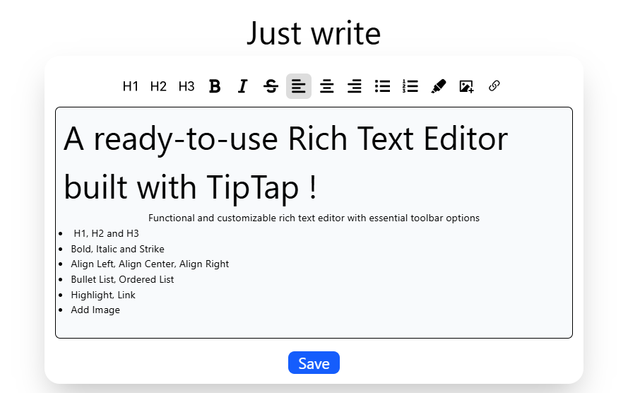

# Just Write: A Next.js Rich Text Editor

A ready-to-use project with a Rich Text Editor built with [TipTap](https://tiptap.dev/) and Next.js.



## ✨ Features

This project offers a functional and customizable rich text editor with essential toolbar options:
- H1
- H2
- H3
- Bold
- Italic
- Strike
- Align Left
- Align Center
- Align Right
- Bullet List
- Ordered List
- Highlight
- Add Image
- Link

## 🚀 Getting Started

To run the project locally:

```bash
npm install
npm run dev
```

Then open [http://localhost:3000/dashboard](http://localhost:3000/dashboard) in your browser.

## 🛠️ Tech Stack

- [Next.js](https://nextjs.org/)
- [Tailwind CSS](https://tailwindcss.com/)
- [TypeScript](https://www.typescriptlang.org/)
- [TipTap](https://tiptap.dev/)


